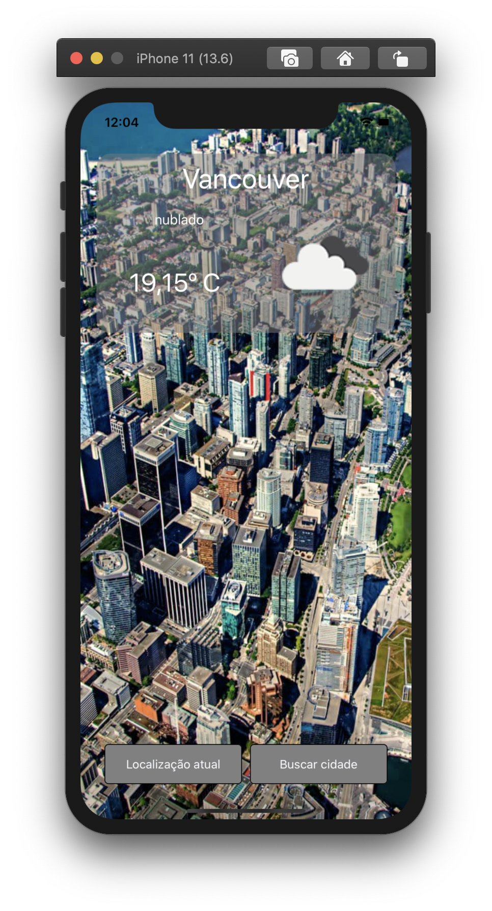

# openWeatherApp
Open Weather App

## Sobre

  * App feito utilizando OpenAPI para informações do clima e imagens utilizadas pela API do Teleport.

## Uso

  * Pode buscar informações de clima de sua cidade pelo botão "Localização atual" ou buscar uma cidade de seu interesse pelo botão "Buscar cidade"

## Screenshots

     

